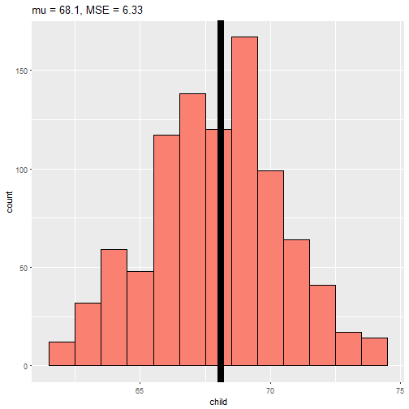

Finding minimum mean square error of child height
========================================================
author: yhyim
date: 2017-06-25
autosize: true

Finding minimum mean square error with galton data
========================================================

- If there was no variation in the data, every value of Yi was the same, then there would be no
error around the mean. 
- Otherwise, our estimate has to balance the fact that our estimate of mu is not going to predict every observation perfectly.
- We can investigate estimates and their mean squared error with galton data.

The data
========================================================


```r
library(UsingR)
data(galton)
summary(galton$child)
```

```
   Min. 1st Qu.  Median    Mean 3rd Qu.    Max. 
  61.70   66.20   68.20   68.09   70.20   73.70 
```

Minimum mean square error of child height
========================================================
- The population mean(mu) minimizes the sum of the squared deviations.



Thanks
========================================================
